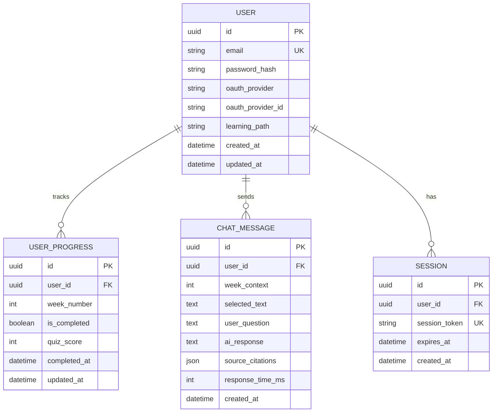
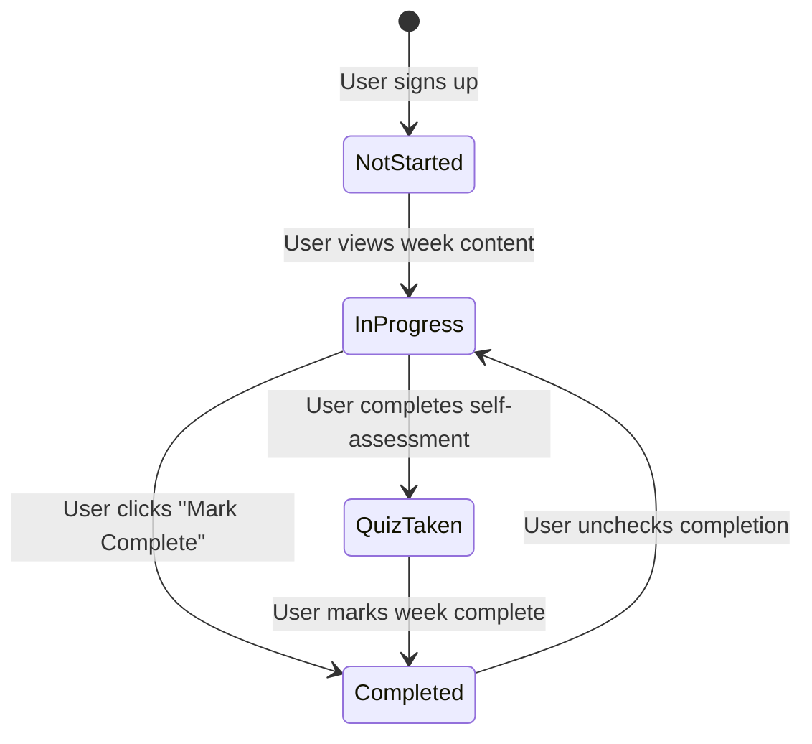

# Data Model: Physical AI & Humanoid Robotics Portal

**Feature**: 001-robotics-portal
**Date**: 2025-12-18
**Phase**: Phase 1 - Design

## Overview

This document defines the database schemas for Neon Postgres (relational data) and Qdrant (vector embeddings) used by the Physical AI & Humanoid Robotics Portal.

## Relational Database (Neon Postgres)

### Entity Relationship Diagram



---

### Table: `users`

**Purpose**: Store user account information and preferences.

| Column | Type | Constraints | Description |
|--------|------|-------------|-------------|
| `id` | UUID | PRIMARY KEY, DEFAULT uuid_generate_v4() | Unique user identifier |
| `email` | VARCHAR(255) | UNIQUE, NOT NULL | User email address |
| `password_hash` | VARCHAR(255) | NULLABLE | Bcrypt hash (NULL for OAuth users) |
| `oauth_provider` | VARCHAR(50) | NULLABLE | OAuth provider name (google, github, NULL for email) |
| `oauth_provider_id` | VARCHAR(255) | NULLABLE | Provider-specific user ID |
| `learning_path` | VARCHAR(20) | NOT NULL, DEFAULT 'beginner' | 'beginner' or 'advanced' |
| `created_at` | TIMESTAMP | NOT NULL, DEFAULT NOW() | Account creation timestamp |
| `updated_at` | TIMESTAMP | NOT NULL, DEFAULT NOW() | Last update timestamp |

**Indexes**:
- `idx_users_email` on `email` (unique lookup)
- `idx_users_oauth` on `(oauth_provider, oauth_provider_id)` (OAuth login)

**Validation Rules**:
- `email` must match RFC 5322 format
- `learning_path` must be one of: ['beginner', 'advanced']
- If `oauth_provider` is NOT NULL, then `oauth_provider_id` must NOT be NULL
- If `oauth_provider` is NULL, then `password_hash` must NOT be NULL

---

### Table: `user_progress`

**Purpose**: Track which weeks each user has completed and quiz scores.

| Column | Type | Constraints | Description |
|--------|------|-------------|-------------|
| `id` | UUID | PRIMARY KEY, DEFAULT uuid_generate_v4() | Unique progress record ID |
| `user_id` | UUID | FOREIGN KEY (users.id), NOT NULL | User who owns this progress |
| `week_number` | INT | NOT NULL, CHECK (week_number BETWEEN 1 AND 13) | Week number (1-13) |
| `is_completed` | BOOLEAN | NOT NULL, DEFAULT false | Whether user marked week complete |
| `quiz_score` | INT | NULLABLE, CHECK (quiz_score BETWEEN 0 AND 100) | Self-assessment score (0-100%) |
| `completed_at` | TIMESTAMP | NULLABLE | When user marked week complete |
| `updated_at` | TIMESTAMP | NOT NULL, DEFAULT NOW() | Last update timestamp |

**Indexes**:
- `idx_user_progress_user_week` on `(user_id, week_number)` (unique constraint + fast lookup)

**Validation Rules**:
- `week_number` must be 1-13
- `quiz_score` (if not NULL) must be 0-100
- Each `(user_id, week_number)` pair must be unique (one progress record per week per user)
- `completed_at` should be set when `is_completed` transitions from false to true

---

### Table: `chat_messages`

**Purpose**: Store chatbot conversation history for authenticated users.

| Column | Type | Constraints | Description |
|--------|------|-------------|-------------|
| `id` | UUID | PRIMARY KEY, DEFAULT uuid_generate_v4() | Unique message ID |
| `user_id` | UUID | FOREIGN KEY (users.id), NOT NULL | User who sent the message |
| `week_context` | INT | NULLABLE, CHECK (week_context BETWEEN 1 AND 13) | Week number user was viewing (NULL if general query) |
| `selected_text` | TEXT | NULLABLE | Text highlighted by user (NULL if no selection) |
| `user_question` | TEXT | NOT NULL | User's question to chatbot |
| `ai_response` | TEXT | NOT NULL | Chatbot's answer |
| `source_citations` | JSONB | NOT NULL, DEFAULT '[]' | Array of `{week: int, section: string}` objects |
| `response_time_ms` | INT | NOT NULL | Response latency in milliseconds |
| `created_at` | TIMESTAMP | NOT NULL, DEFAULT NOW() | Message timestamp |

**Indexes**:
- `idx_chat_user_time` on `(user_id, created_at DESC)` (fetch recent chat history)
- `idx_chat_week` on `week_context` (analytics queries)

**Validation Rules**:
- `week_context` (if not NULL) must be 1-13
- `source_citations` must be valid JSON array
- `response_time_ms` must be >= 0

**Example `source_citations` JSON**:
```json
[
  {"week": 3, "section": "Forward Kinematics"},
  {"week": 3, "section": "DH Parameters"}
]
```

---

### Table: `sessions`

**Purpose**: Manage user authentication sessions (Better-Auth backend).

| Column | Type | Constraints | Description |
|--------|------|-------------|-------------|
| `id` | UUID | PRIMARY KEY, DEFAULT uuid_generate_v4() | Unique session ID |
| `user_id` | UUID | FOREIGN KEY (users.id), NOT NULL | User owning this session |
| `session_token` | VARCHAR(255) | UNIQUE, NOT NULL | JWT or opaque session token |
| `expires_at` | TIMESTAMP | NOT NULL | Session expiration time |
| `created_at` | TIMESTAMP | NOT NULL, DEFAULT NOW() | Session creation timestamp |

**Indexes**:
- `idx_sessions_token` on `session_token` (unique lookup)
- `idx_sessions_user` on `user_id` (list user's sessions)
- `idx_sessions_expires` on `expires_at` (cleanup expired sessions)

**Validation Rules**:
- `expires_at` must be in the future at creation time
- Expired sessions (expires_at < NOW()) should be periodically deleted via cron job

---

## Vector Database (Qdrant)

### Collection: `robotics_textbook_embeddings`

**Purpose**: Store vector embeddings of textbook content for RAG retrieval.

**Configuration**:
- **Vector Size**: 1536 (OpenAI `text-embedding-3-small` dimension)
- **Distance Metric**: Cosine similarity
- **Index**: HNSW (Hierarchical Navigable Small World) for fast ANN search

**Payload Schema** (metadata attached to each vector):

| Field | Type | Description | Example |
|-------|------|-------------|---------|
| `week` | int | Week number (1-13) | 3 |
| `section` | string | Section title | "Forward Kinematics" |
| `subsection` | string | Subsection (if applicable) | "DH Parameters" |
| `difficulty` | string | Content difficulty level | "beginner", "intermediate", "advanced" |
| `language` | string | Content language | "en" or "ur" |
| `text_chunk` | string | Original text (500 tokens) | "The Denavit-Hartenberg parameters..." |
| `chunk_index` | int | Chunk number within section | 0, 1, 2, ... |

**Indexing Strategy**:
```python
from qdrant_client import QdrantClient
from qdrant_client.models import Distance, VectorParams

client = QdrantClient(url="https://qdrant-cloud-url", api_key="...")

client.create_collection(
    collection_name="robotics_textbook_embeddings",
    vectors_config=VectorParams(size=1536, distance=Distance.COSINE),
)
```

**Metadata Filters** (for targeted RAG):
- Filter by `week` to retrieve only content from current week
- Filter by `difficulty` to match user's learning path
- Filter by `language` for Urdu-translated content (Phase 2)

**Example Query**:
```python
# Find top-5 chunks related to user's question about "inverse kinematics"
results = client.search(
    collection_name="robotics_textbook_embeddings",
    query_vector=question_embedding,  # 1536-dim vector from OpenAI
    query_filter={
        "must": [
            {"key": "week", "match": {"value": 4}},
            {"key": "difficulty", "match": {"any": ["beginner", "intermediate"]}},
        ]
    },
    limit=5,
)
```

---

## Data Relationships

### User → Progress (1:Many)

- One user has multiple progress records (one per week)
- Cascading delete: If user deleted, all progress records deleted
- Use case: Display completion tracker (e.g., "5 of 13 weeks completed")

### User → Chat Messages (1:Many)

- One user has multiple chat messages
- Cascading delete: If user deleted, chat history deleted
- Use case: Load "Chat History" sidebar showing past conversations

### User → Sessions (1:Many)

- One user can have multiple active sessions (e.g., logged in on laptop and phone)
- Cascading delete: If user deleted, sessions invalidated
- Use case: Session-based authentication, revoke all sessions on password change

### Vector Embeddings → Postgres (Loose Coupling)

- Vector embeddings reference content by `(week, section)` in payload
- No foreign key constraints (Qdrant is separate DB)
- Use case: When chatbot retrieves chunks, payload metadata provides `week` and `section` for source citations

---

## State Transitions

### User Progress State Machine



**State Definitions**:
- **NotStarted**: No `user_progress` record exists for this week
- **InProgress**: `user_progress` record exists with `is_completed = false`
- **QuizTaken**: `user_progress.quiz_score` is NOT NULL
- **Completed**: `user_progress.is_completed = true` and `completed_at` set

**Business Rules**:
- Users can mark weeks complete without taking quiz (quiz is optional)
- Users can retake quizzes (update `quiz_score`)
- Completion percentage = COUNT(is_completed = true) / 13 * 100

---

## Database Migrations

### Alembic Migration Strategy

**Initial Schema** (Migration 001):
```sql
-- Create users table
CREATE EXTENSION IF NOT EXISTS "uuid-ossp";

CREATE TABLE users (
    id UUID PRIMARY KEY DEFAULT uuid_generate_v4(),
    email VARCHAR(255) UNIQUE NOT NULL,
    password_hash VARCHAR(255),
    oauth_provider VARCHAR(50),
    oauth_provider_id VARCHAR(255),
    learning_path VARCHAR(20) NOT NULL DEFAULT 'beginner',
    created_at TIMESTAMP NOT NULL DEFAULT NOW(),
    updated_at TIMESTAMP NOT NULL DEFAULT NOW(),
    CONSTRAINT chk_auth_method CHECK (
        (oauth_provider IS NOT NULL AND oauth_provider_id IS NOT NULL AND password_hash IS NULL) OR
        (oauth_provider IS NULL AND oauth_provider_id IS NULL AND password_hash IS NOT NULL)
    )
);

-- Create user_progress table
CREATE TABLE user_progress (
    id UUID PRIMARY KEY DEFAULT uuid_generate_v4(),
    user_id UUID NOT NULL REFERENCES users(id) ON DELETE CASCADE,
    week_number INT NOT NULL CHECK (week_number BETWEEN 1 AND 13),
    is_completed BOOLEAN NOT NULL DEFAULT false,
    quiz_score INT CHECK (quiz_score BETWEEN 0 AND 100),
    completed_at TIMESTAMP,
    updated_at TIMESTAMP NOT NULL DEFAULT NOW(),
    UNIQUE (user_id, week_number)
);

-- Create chat_messages table
CREATE TABLE chat_messages (
    id UUID PRIMARY KEY DEFAULT uuid_generate_v4(),
    user_id UUID NOT NULL REFERENCES users(id) ON DELETE CASCADE,
    week_context INT CHECK (week_context BETWEEN 1 AND 13),
    selected_text TEXT,
    user_question TEXT NOT NULL,
    ai_response TEXT NOT NULL,
    source_citations JSONB NOT NULL DEFAULT '[]',
    response_time_ms INT NOT NULL CHECK (response_time_ms >= 0),
    created_at TIMESTAMP NOT NULL DEFAULT NOW()
);

-- Create sessions table
CREATE TABLE sessions (
    id UUID PRIMARY KEY DEFAULT uuid_generate_v4(),
    user_id UUID NOT NULL REFERENCES users(id) ON DELETE CASCADE,
    session_token VARCHAR(255) UNIQUE NOT NULL,
    expires_at TIMESTAMP NOT NULL,
    created_at TIMESTAMP NOT NULL DEFAULT NOW()
);

-- Create indexes
CREATE INDEX idx_users_email ON users(email);
CREATE INDEX idx_users_oauth ON users(oauth_provider, oauth_provider_id);
CREATE INDEX idx_user_progress_user_week ON user_progress(user_id, week_number);
CREATE INDEX idx_chat_user_time ON chat_messages(user_id, created_at DESC);
CREATE INDEX idx_chat_week ON chat_messages(week_context);
CREATE INDEX idx_sessions_token ON sessions(session_token);
CREATE INDEX idx_sessions_user ON sessions(user_id);
CREATE INDEX idx_sessions_expires ON sessions(expires_at);
```

**Sample Data** (for testing):
```sql
-- Insert test user
INSERT INTO users (email, password_hash, learning_path)
VALUES ('student@panaversity.pk', '$2b$12$...hashed_password...', 'beginner');

-- Insert progress for Week 1
INSERT INTO user_progress (user_id, week_number, is_completed, quiz_score, completed_at)
VALUES (
    (SELECT id FROM users WHERE email = 'student@panaversity.pk'),
    1,
    true,
    85,
    NOW()
);
```

---

## Data Retention & Privacy

**User Data Retention**:
- Active accounts: Data retained indefinitely
- Inactive accounts (no login for 2 years): Email user for confirmation before deletion
- Deleted accounts: Hard delete from `users` table (cascades to progress, chat, sessions)

**Chat History Retention**:
- Authenticated users: Full chat history retained
- Anonymous users (future feature): Chat history expires after 7 days

**Analytics Data Retention** (PostHog):
- Event data retained for 12 months
- Anonymized after 12 months (user IDs removed)

**GDPR Compliance**:
- Users can request data export (JSON format)
- Users can request account deletion (complete data purge within 30 days)

---

## Performance Considerations

**Query Optimization**:
- Use `(user_id, created_at DESC)` index for paginated chat history
- Use `(user_id, week_number)` composite index for progress lookups (avoid full table scan)
- Partition `chat_messages` by month if table exceeds 10M rows (future optimization)

**Connection Pooling**:
- FastAPI uses `asyncpg` with pool size = 20 (sufficient for 100 concurrent users)
- Neon Serverless auto-scales connections

**Vector Search Performance**:
- HNSW index provides O(log N) search complexity
- Expected latency: <100ms for top-5 retrieval with 1000 vectors
- Scaling: If embeddings exceed 100K vectors, consider sharding by week

---

## Security Considerations

**Password Storage**:
- Use `bcrypt` with cost factor 12 for password hashing
- Never store plaintext passwords
- Enforce minimum password length (8 characters)

**SQL Injection Prevention**:
- Use SQLAlchemy ORM with parameterized queries (no raw SQL)
- Validate all user inputs (email format, week number ranges)

**Session Security**:
- Session tokens are cryptographically random (256-bit entropy)
- HTTPS-only cookies (Secure flag)
- Expire sessions after 7 days of inactivity

**API Rate Limiting** (to prevent abuse):
- Unauthenticated users: 5 chatbot queries per session
- Authenticated users: 100 chatbot queries per hour (reset hourly)
- Implement via Redis rate limiter or FastAPI middleware
